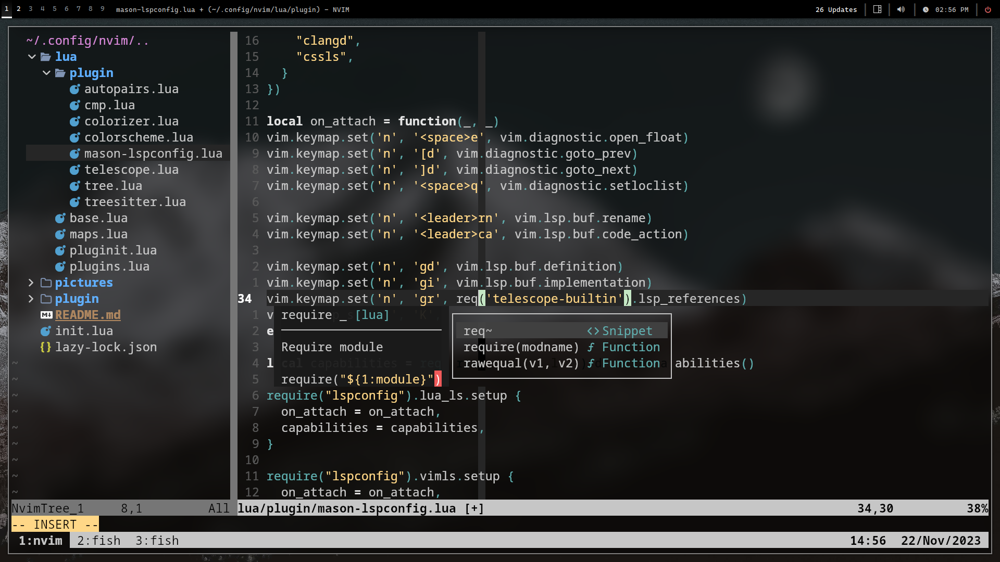

# Neovim dotfiles



## ⚡️ Requirements

- [Neovim](https://neovim.io/) >= **0.9.0** (needs to be built with **LuaJIT**)
- [Git](https://git-scm.com/) >= **2.19.0**
- [Nodejs](https://nodejs.org/en)
- [NPM](https://www.npmjs.com/)
- [Unzip](https://archlinux.org/packages/extra/x86_64/unzip/) ***(or similars)***
- [Curl](https://curl.se/)
- [Nerd Font](https://github.com/ryanoasis/nerd-fonts) ***(Optional)***
- [C Compiler](https://github.com/nvim-treesitter/nvim-treesitter#requirements) for `nvim-treesitter`
- For [telescope.nvim](https://github.com/nvim-telescope/telescope.nvim) **_(optional)_**
  - **live grep**: [ripgrep](https://github.com/BurntSushi/ripgrep)
  - **find files**: [fd](https://github.com/sharkdp/fd)
- A terminal that support true color and _undercurl_:
  - [Kitty](https://github.com/kovidgoyal/kitty) ***(Linux & Macos)***
  - [Wezterm](https://github.com/wez/wezterm) ***(Linux, Macos & Windows)***
  - [Alacritty](https://github.com/alacritty/alacritty) ***(Linux, Macos & Windows)***
  - [Iterm2](https://iterm2.com/) ***(Macos)***

## 🛠 Instalation

- #### Make a backup of your current nvim files

`mv ~/.config/nvim{,.bak}`

- #### Optional but recommended

```
mv ~/.local/share/nvim{,.bak}
mv ~/.local/state/nvim{,.bak}
mv ~/.cache/nvim{,.bak}
```

- #### Clone the repo

`git clone https://github.com/PacosMosis/nvim ~/.config/nvim`

- #### Remove the `.git` folder 

`rm -rf ~/.config/nvim/.git`

- #### Start Neovim!

`nvim`

## 📂 File Structure

You can add your custom plugin specs under `lua/plugins/`. All files there
will be automatically loaded by [lazy.nvim](https://github.com/folke/lazy.nvim)

```
~/.config/nvim
├── lua
│   ├── plugin
│   │   ├── base.lua
│   │   ├── maps.lua
│   │   ├── pluginit.lua
│   │   └── plugins.lua
│   └── plugins
│       ├── autopairs.lua
│       ├── cmp.lua
│       ├── colorizer.lua
│       ├── colorscheme.lua
│       ├── mason-lspconfig.lua
│       ├── telescope.lua
│       ├── tree.lua
│       └── treesitter.lua
└── init.lua
```

## 💡 Tip

It is recommended to run `:checkhealth` after installation
